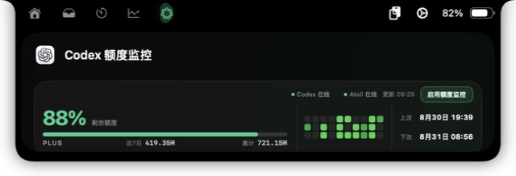

# Codex Quota for Atoll

在 macOS 的 [Atoll](https://github.com/Ebullioscopic/Atoll) 翻页卡片中查看 Codex 剩余额度、30 天 token 使用热力与重置时间。

> 非官方社区插件，与 OpenAI 或 Atoll 官方无隶属关系。



## 功能

- 单页横向卡片，无需下拉滚动。
- 60% / 20% / 20% 布局：额度与长进度条、按列由上到下排列的 3 × 10 近 30 天 token 热力图、上次与下次重置时间。
- 自动补齐没有活动的日期，并以 4 档绿色深浅呈现每天的相对用量。
- 右上角集中显示 Codex/Atoll 连接状态、更新时间与监控按钮；启用状态会跨重启保留，按钮可随时重复刷新。
- 卡片标题为“Codex 额度监控”；进度条下方依次显示 `PLUS`、近 7 日与累计用量，不显示“今天”统计或重置估算标记。
- 启动时读取一次数据，启用监控后在线时每 60 秒自动刷新；离线时每 15 秒重试，也可点“刷新额度”立即重连。超过 150 秒没有收到新数据时，卡片会明确标记“数据已过期”。
- 菜单栏可手动刷新、重新显示或关闭 Atoll 卡片。

## 系统要求

- macOS 13 或更高版本
- [Atoll 2.3.3](https://github.com/Ebullioscopic/Atoll/releases) 或更高版本
- 已安装并登录 ChatGPT/Codex 桌面应用，或已安装 Codex CLI

## 安装

1. 从 [Releases](https://github.com/lichengding0813/codex-quota-for-atoll/releases/latest) 下载 `CodexQuotaIsland.zip`。
2. 解压并将 `CodexQuotaIsland.app` 移到“应用程序”，首次启动可右键选择“打开”。
3. 在 Atoll → 设置 → 扩展中启用：
   - 第三方扩展
   - Notch Experiences
   - 显示扩展标签页
   - 交互式 Web 内容
4. 在应用菜单中授权 Atoll，展开 Atoll 后切换到扩展标签页。
5. 点击卡片右上角“启用额度监控”；启用后可用同一位置的“刷新额度”按钮手动刷新。

### Atoll 2.3.3 兼容启动项

如果应用提示 Atoll 没有注册扩展服务，请同时下载 `Atoll-2.3.3-Extension-Host.zip`，并按照压缩包内说明安装用户级 LaunchAgent。它只改变 Atoll 的启动方式，不修改 `/Applications/Atoll.app`。

## 数据与隐私

应用通过本机 `codex app-server --stdio` 调用 `account/rateLimits/read` 和 `account/usage/read`。30 天热力图使用后者返回的按日 token 数据，缺失日期按无活动处理。额度数据不会上传到本项目维护的服务器；卡片按钮只访问应用自身随机端口和随机令牌保护的 loopback 地址。

## 从源码构建

```sh
git clone https://github.com/lichengding0813/codex-quota-for-atoll.git
cd codex-quota-for-atoll
./scripts/build-app.sh
```

构建结果位于 `dist/CodexQuotaIsland.app` 和 `dist/CodexQuotaIsland.zip`。项目将 AtollExtensionKit 固定到已验证提交，避免上游变更造成不可重复构建。

也可以只构建 Swift 可执行文件：

```sh
swift build -c release
```

## 开发说明

- Atoll 集成：`AtollNotchExperienceDescriptor`
- UI：SwiftUI 菜单栏应用 + Atoll 交互式 Web 卡片
- 最低系统：macOS 13
- 当前版本：0.4.3

欢迎提交 Issue 和 Pull Request。

## 许可证

本项目采用 [MIT License](LICENSE)。依赖的 AtollExtensionKit 仍遵循 LGPL-3.0，详情见 [THIRD_PARTY_NOTICES.md](THIRD_PARTY_NOTICES.md)。
